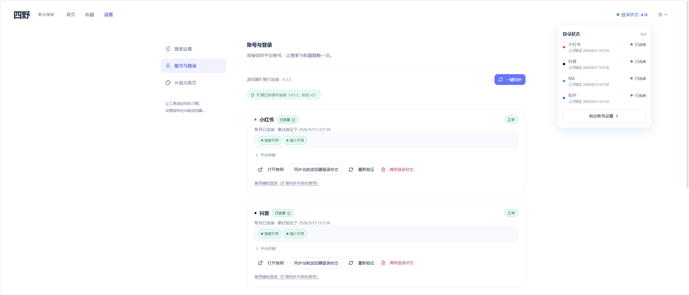
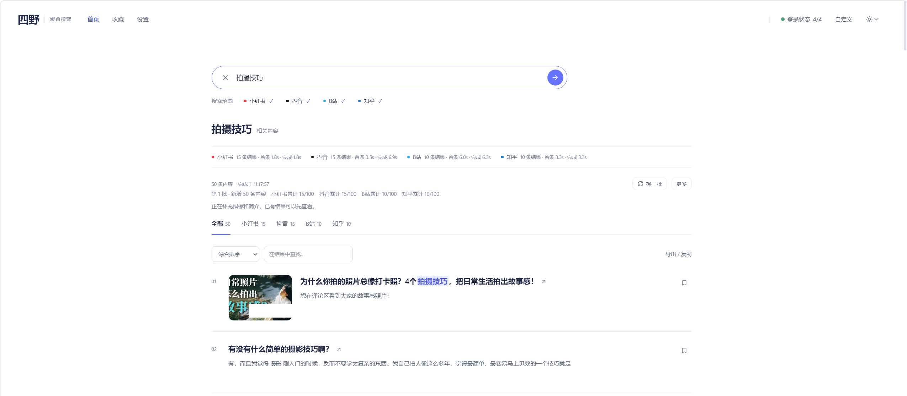

# 四野 · 使用说明

四野装好之后**不能直接开始搜**。先花两分钟做完下面两件事，之后就只是输入关键词而已。

> 网页版说明：<https://kellengo.github.io/MediaCrawler/guide.html>

---

## 开始前，先做完这两件事

### 1. 在你的浏览器里登录这四个平台

用 Chrome 或 Edge（Windows 一般自带 Edge）打开**小红书、抖音、B 站、知乎**，分别登录你自己的账号。

四野是**借用你本人的登录状态**去替你搜索的 —— 没登录，就搜不出东西，或者结果非常少。

### 2. 装上四野的浏览器插件，把登录状态同步过来

插件的作用只有一个：把你刚登录的状态交给本机运行的四野。装一次就行，以后打开程序会自动同步。

1. 浏览器地址栏输入 `chrome://extensions`（Edge 是 `edge://extensions`）回车；
2. 打开右上角的**「开发者模式」**；
3. 点**「加载已解压的扩展程序」**，选择解压目录里的 `MediaCrawler/browser_extension/`；
4. 回到四野页面，打开**「账号设置」**，点各平台的「同步当前浏览器登录状态」。

> **最常见的误会**：以为下载完打开就能搜。
> 没做这两步，搜索结果大概率是空的，或一直提示「需要登录」—— 不是软件坏了。

---

## 下载与启动

1. 下载 `MediaCrawler-Windows-x64.zip`，**整个解压**到一个文件夹（不要把 EXE 单独拷出来，旁边的 `_internal`、`webui` 都要用）。
   建议解压到**英文路径**，比如 `D:\Siye` —— 中文或带空格的路径偶尔会导致启动异常；
2. 打开解压出的 `MediaCrawler` 文件夹，双击 `MediaCrawler.exe`；
3. 等黑色控制台出现 **backend ready**，浏览器会**自动打开** `127.0.0.1:8080`，就可以搜了。

> 不需要安装 Python、Node.js，也不用敲命令。用完关掉页面，再关掉控制台窗口即可。
> 想搜出东西，记得先做完上面那两件事（登录 + 装插件）。

> **第一次运行被 Windows 拦下来？**
> 程序没有代码签名，SmartScreen 可能弹「Windows 已保护你的电脑」—— 点**「更多信息」→「仍要运行」**即可。
> 杀毒软件误报时把解压目录加进白名单。程序只在本机 `127.0.0.1:8080` 监听，不对外提供服务，也不上传任何数据。

---

## 开始搜索

在搜索框输入关键词，勾上要搜的平台，回车。四个平台会**同时**搜，谁先回来谁先显示；某一个失败或超时，其他平台照常出结果。

想换个排法就切**综合 / 最新 / 互动最多**；想缩小范围就用上方的筛选（近 7 天 / 近 30 天、内容类型、关键词，多个关键词用空格分隔）。筛选只对已经搜回来的结果生效，不会重新去搜。

---

## 搜到之后还能做什么

- **收藏与备注**：点卡片右上角的书签图标；在搜索框下方进「本地收藏」统一看，可加备注（最多 1000 字，上限 500 条）。
- **导出**：点「导出 / 复制」，可以导出 CSV（Excel 打开中文不乱码）、Markdown，或批量复制原文链接。不勾选就导出当前全部，勾选了只导出选中的。
- **跨平台收藏**：把你在各平台已经收藏过的内容拉到一页里统一看（每次每平台 20 条，只读，不会改动你在平台上的收藏）。

> **收藏存在浏览器里**：清除网站数据或换浏览器会丢。
> 做这些操作前，先在「本地收藏」里点**「备份全部收藏」**下载 JSON，之后可以导回来。

---

## 常见问题

**搜不出东西 / 提示需要登录**
回到最上面那两件事：先在浏览器登录平台，再装插件同步。九成问题出在这里。

**某平台结果特别少**
平台风控、关键词太窄、字段变化都会导致。建议当作参考，不要当成完整数据。

**提示限流冷却**
本地会等 60 秒，反复触发延长到 120 / 240 / 300 秒。**其他平台不受影响**，冷却结束手动重试。

**第一次搜索很慢**
首次要启动浏览器，之后快很多；同样的关键词 90 秒内有缓存，会立刻返回。

**双击没反应**
确认是完整解压、目录可写；看控制台窗口里的报错。杀毒软件拦截的话把目录加白名单。

**8080 端口被占用**
说明已经有一个四野在跑，关掉它的控制台再启动。

**收藏不见了**
清了网站数据或换了浏览器，只能用之前备份的 JSON 导入恢复。

**能商用吗**
**不能。** 本项目为非商业学习许可，严禁任何商业用途或盈利活动，详见[许可与免责声明](https://kellengo.github.io/MediaCrawler/#license)。

---

## 隐私与许可

- **可以下载使用**：个人学习、研究、自用免费，不需要付费或授权；
- **不能商用**：严禁用于任何商业用途或盈利活动，商用须取得版权所有者书面同意；
- **不能大规模抓取**：仅限学习研究，不得批量采集或干扰平台正常运营；
- **后果自负**：因违规使用造成的一切后果由使用者自行承担；
- 账号 profile、缓存、收藏全部存在**本机**，后端只监听 `127.0.0.1:8080`，不上传任何数据。

完整条款见[许可与免责声明](https://kellengo.github.io/MediaCrawler/#license)与仓库中的 [LICENSE 全文](https://github.com/KellenGO/MediaCrawler/blob/main/LICENSE)。

还有问题？到 [GitHub Issues](https://github.com/KellenGO/MediaCrawler/issues) 提。
